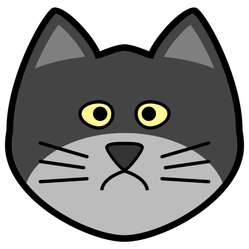

# Header H1
## Header H2
### Header H3
#### Header H4
##### Header H5
###### Header H6
______________________________________________

**Bold text**
*Italic text**

__Bold text__
_Italic text_

Plain text *Italic text **Bold italic text**  Italic text* Plain text

~~Crossed out text~~

______________________________________________

### Ordered List
1. Item 1
1. Item 2
   1. Item 2.1
   1. Item 2.2
1. Item 3

### Unordered List
* Item 1
* Item 2
  * Item 2.1
  * Item 2.2
* Item 3

### Task List
- [x] Task 1
- [x] Task 2
- [ ] Task 3
______________________________________________

### Table

Header 1 | Header 2
------------ | -------------
Cell 1.1 | Cell 1.2
Cell 2.1 | Cell 2.2

______________________________________________

### Blockquotes
One Great Man said:

> Some words that were said
> by one great man

______________________________________________

### Code inside of text
Some text `<h1>` Some text

______________________________________________

### Code block
``` python
function f(x):
   return x*x
```
______________________________________________

### Links 
[GitHub](http://github.com)

http://github.com - this link will be converted automatically

______________________________________________

### Images
Common format:


Example: 



______________________________________________
